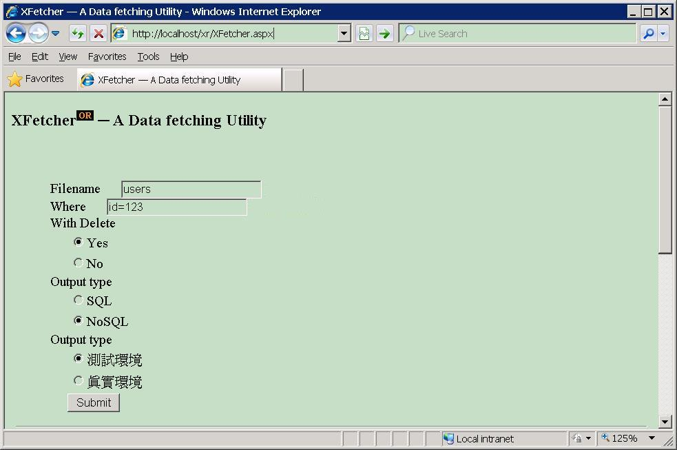

### Incompatibility is our business

### Prologue
[ASSUMPTION](https://www.oxfordlearnersdictionaries.com/definition/english/assumption?q=assumptions) a belief or feeling that something is true or that something will happen, although there is no proof. Bearing a smell of superstition, it is a presentiment of no rationale, an omen of no base. Strange enough, we all live in it and work for it. Every thought and every action, there is an impending and expected outcome. So to speak, not the least a serious science issue. 


### I. Introduction
[MySQL](https://www.mysql.com/) and [MongoDB](https://www.mongodb.com/) are two of the most commonly heard terms in web development (i believe), The former is SQL while the latter is NoSQL database, both of them are free to use and suit for production as well as learning purpose. A discussion and benefit of NoSQL can be found [here](https://www.mongodb.com/nosql-explained/nosql-vs-sql). 

Ever since I learned programming, at a certain point of implementation, we have to choose a way to store our data, ie. database. From then on, programs evolve overtime but seldom change the store unless extensive code rewrite is involved. Even you have a brave heart, a more tedious as well as challenging drudgery of data migration is waiting for you... More often than not, backend database prevent frontend from changing. They just intermingled and bounded together. It must be replace altogether or all at once when system crashed. 

In this article, the MySQL Server to be used is version 8.0.30 and MongoDB Server to be used is version 4.0.3. Both servers are spinned up via [Laragon](https://laragon.org/index.html). The client to be used is [phpMyAdmin](https://www.phpmyadmin.net/) version 5.0.2 and [MongoDB Compass](https://www.mongodb.com/products/tools/compass) version 1.30.1. 


### II. MySQL
The package used is [mysql2](https://www.npmjs.com/package/mysql2) which supports connection pool and promise, which is essential in modern javascript programming. Relational databases are powerful but rigid, all data must be formulated in tabular forms, aka [Normal Forms](https://www.geeksforgeeks.org/normal-forms-in-dbms/). 
```
CREATE TABLE animals (
     id MEDIUMINT NOT NULL AUTO_INCREMENT,
     name CHAR(30) NOT NULL,
     PRIMARY KEY (id)
);

INSERT INTO animals (name) VALUES
    ('dog'),('cat'),('penguin'),
    ('lax'),('whale'),('ostrich');

SELECT * FROM animals;
```

Traditional relational databases tend to be enormous and monolithic. MySQL has a good support of [clustering](https://dev.mysql.com/doc/index-cluster.html) but [partitioning](Partitioning) is problematic, the full syntax of [CREATE TABLE Statement](https://dev.mysql.com/doc/refman/8.0/en/create-table.html) can be a state of bewilderment. 


### III. MongoDB
The package used is [mongodb](https://www.npmjs.com/package/mongodb) which is The official MongoDB driver for Node.js. NoSQL database is designed to be flexible, with intrinsic clustering and sharding capabilities. 

Most people refers MongoDB as *schemaless* but I would like to call it *optional schema*. The [`db.createCollection()`](https://www.mongodb.com/docs/manual/reference/method/db.createCollection/) command has *validator* options in which a [JSON Schema](https://www.mongodb.com/docs/manual/core/schema-validation/specify-json-schema/#std-label-schema-validation-json) can be specified. 

```
db.createCollection("students", {
   validator: {
      $jsonSchema: {
         bsonType: "object",
         title: "Student Object Validation",
         required: [ "address", "major", "name", "year" ],
         properties: {
            name: {
               bsonType: "string",
               description: "'name' must be a string and is required"
            },
            year: {
               bsonType: "int",
               minimum: 2017,
               maximum: 3017,
               description: "'year' must be an integer in [ 2017, 3017 ] and is required"
            },
            gpa: {
               bsonType: [ "double" ],
               description: "'gpa' must be a double if the field exists"
            }
         }
      }
   }
} )
```


### IV. The Gate 
I was thinking there exists such a tools to help me convert MySQL tables to/from MongoDB documents and it did. Projects such as [mysql-mongo-etl](https://github.com/dannysofftie/mysql-mongo-etl/tree/master) and [RestApp](https://restapp.io/) are such and such tools and can do so and so... Still, doesn't meet my need. My goal is to convert simple tables, very very simple tables with simple datatypes, very very primitive datatypes to and from these two databases. 


### V. Summary 
To be elastic and resilient to external impact, a four layers architecture is employed :

1. Data access layer (app/config/mongoDB.js and app/config/mysql.js)
2. API layer (app/api/mongodb/route.js and app/api/mysql/route.js)
3. Server functions (server-actions/actions.js)
4. Client (/components/Main.js)

It only supports flat table with numeric, string, timestamp datatype. 


### VI. Reference
1. [[Series] Data teams How to connect MongoDB to MySQL: The Hard Way vs The Easy Way](https://restapp.io/blog/mongodb-to-mysql/#Method_2_A_Simpler_Approach_Utilizing_RestApp_to_Transfer_Data_from_MongoDB_to_MySQL)
2. [RestApp: All-in-one tool for your data pipelines without code](https://restapp.io/)
3. [SQL vs NoSQL: System Design](https://restapp.io/learn/sql-vs-nosql-system-design)
4. [npm | mysql2](https://www.npmjs.com/package/mysql2)
5. [Bulk insert with mysql2 and NodeJs throws 500](https://stackoverflow.com/questions/67672322/bulk-insert-with-mysql2-and-nodejs-throws-500)
6. [npm | mongodb](https://www.npmjs.com/package/mongodb)
7. [How MongoDB Create Collection?](https://www.knowledgehut.com/blog/web-development/mongodb-create-collection)
08. [MySQL Data Types](https://www.w3schools.com/mysql/mysql_datatypes.asp)
09. [MongoDB - Datatypes](https://www.tutorialspoint.com/mongodb/mongodb_datatype.htm)
10. [Connect a Node.js application to PlanetScale](https://planetscale.com/docs/tutorials/connect-nodejs-app)
11. [The Mystery of Edwin Drood](https://www.gutenberg.org/files/564/564-h/564-h.htm)


### Epilogue 



### EOF (2023/10/13)